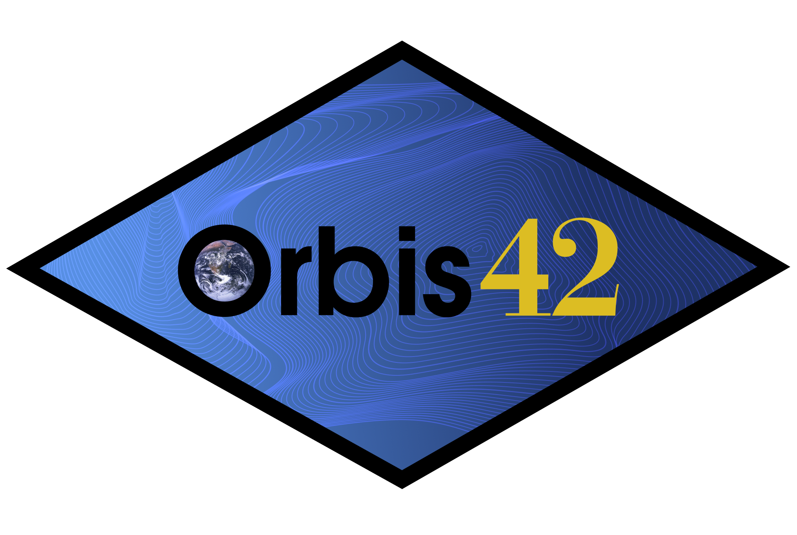

<div align="center">




<br />


[](https://opensource.org/licenses/MIT)
# Natural Asset Smart Contract

</div>

## Summary

A standard for creating and managing natural asset-backed smart contracts using ERC-1155 tokens to represent and track natural capital, incorporating environmental data and enabling markets for ecosystem service commodities.

## Abstract

This project, developed for ETH Global's HackFS 2024, is based in the creation of a new standard for Natural Asset Smart Contracts using ERC-1155 tokens to represent natural assets and their associated ecosystem services.  The standard includes mechanisms for recording historical cummulative effects, baseline data, funding, work being executed for restoration or conservation, time-series data to monitor the changes in the ecosystem, and the registry of environmental commodities like carbon, biodiversity, soil quality and water availability.  NASCs are categorized into 4 types: Project-Based, Municipal, Basin, and Nation State.

## Motivation

Natural capital is the substrate that provide the means for life, it is the set of renewable and non-renewable resources that comprise an ecosystem, elements like water, soil, minerals, flora and fauna are the true metrics to measure the wealth of nations.

Extinction and loss of these critical ecosystems is diminishing at an outstanding rate, and the lack of standardized mechanisms to represent, track, and trade these assets hinders the efficient allocation of capital towards their preservation and restoration.

This standard aims to create a transparent, equitable, and efficient market for natural assets, encouraging investment in nature-based solutions. Differentiating NASCs by territory scope and enabling hierarchical references ensures appropriate management and valuation for varying scales of natural assets.

Additionally, integrating AI oracles allows for real-time data analysis and automatic issuance of ecosystem service commodities, increasing efficiency and accuracy.

# Functional Specifications

## Overview

Natural Asset Smart Contracts are an extension of the ERC-1155 Multi-token standard, that are designed to provide a comprehensive digital record of natural assets, including the territory's location, dimensions, cumulative effects studies, baseline data, regeneration/conservation projects, monitoring data and a registry of the environmental commodities emitted.

## System Architecture

## Contract Level Metadata

In order to maintain interoperability and extend the functionality of non-fungible assets, we propose the use of the contractURI method in ERC-721 and ERC-1155 contracts that provide "collection-level" metadata with adherence to ERC-7572 standard.

```json
{
    "name": "Name of the project / municipality / Basin / Nation State",
    "Description": "Description of the Natural Asset",
    "image": "URL with image for the Asset",
    "banner_image": "",
    "featured_image": "",
    "external_link" : "",
    "collaborators" : "",
    "coordinates": [
        { "lat": 25.774, "lng": -80.19 },
        { "lat": 18.466, "lng": -66.118 },
        { "lat": 32.321, "lng": -64.757 },
        { "lat": 25.774, "lng": -80.19 }
    ],
    "municipality" : "Official Name",
    "state" : "Official Name",
    "country" : "Official Name",
    "basin" : "Hidrological region"
}
```

## Token Mapping

In order to standarize queries and data structures the NASC requires that certain token spaces be designated.

### Financial 0 (Fungible)

```solidity
 tokenId 0 = Funding
```

These tokens can be allocated or sold, depending on the type of NASC and the specific characteristics of the project or funding requirements.

### Environmental Commodities 1-17 (Fungible)

```solidity
 tokenId 1 - 17 = Environmental Commodities
```

These tokens represent the emmission of impact certificates/credits that can be traded and retired, while currently there are only markets for carbon sequestration, the standard is forward looking and thus it includes space for all ecosystem services that are:

#### Provisioning Services

1. Food
2. Raw Materials
3. Fresh Water
4. Medicinal Resources

#### Regulating Services

5. Local Climate
6. Carbon Sequestration
7. Buffers against extreme events
8. Waste Water Treatment
9. Soil Erosion and Fertility
10. Polinization
11. Biological Control

#### Supporting Services

12. Habitat for Species
13. Genetic Biodiversity

#### Cultural Services

14. Inspiration/Aesthetic
15. Tourism
16. Spiritual Experience and Identity
17. Recreation

### Legal/Compliance 18 - 19 (Non Fungible)

```Solidity
tokenId 18 - 19 = Legal and Compliance
```

These tokens include the legal terms under which the NASC is operating, so it can include the investment contract, development contract and lease agreement, municipal resolutions, etc.

### Environmental Data 20 - 29 (Non Fungible)

```Solidity
tokenId 20 - 29 = Baseline and Cummulative Effects Studies
```

These tokens represent the cummulative effects and baseline studies that describe the past and current state of the ecosystems in a territory and it's valued environmental and Social Components.

### Regeneration / Conservation Methodologies 30-39

```Solidity
tokenId 30 - 39 = Methodologies
````

Documentation related to the conservation or regeneration methodologies being executed in the territory

### Time series monitoring data

```Solidity
tokenId 40 ...
````

After token Id 40, the instrument stores a stratified data capture that comes from randomized sources that include: Satellite - from EESA Copernicus program, Drone - from designated sources, Field Observations - from designated sources.

## Technological Stack

### Filecoin

-- Storage and data inmutability
